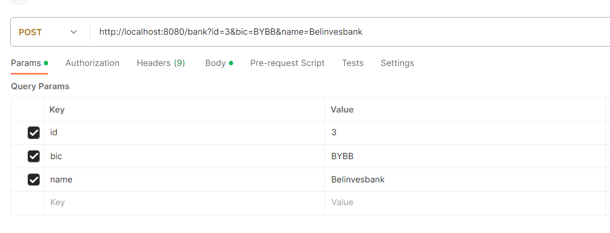
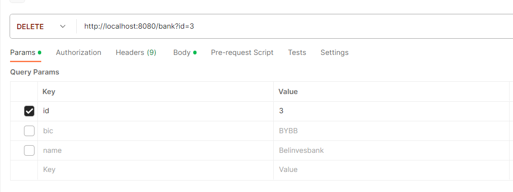
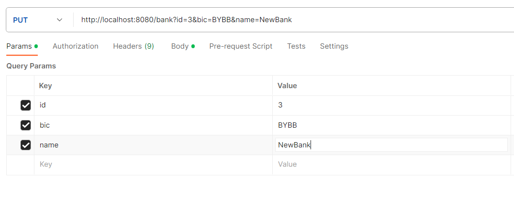
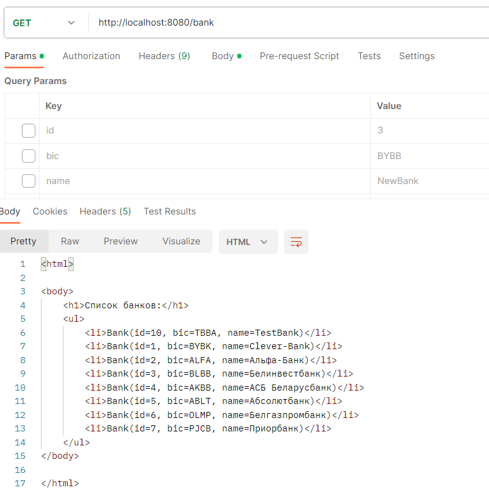

<h1 align="center"> Bank System</h1>
-----------
<h2 align="center">Author: <a href="https://github.com/Yagrus" target="_blank">Chuiko Ruslan</a></h2>
-----------
<h2 align="center">Введение</h2>
-----------
Всем привет, я здесь, чтобы продемонстрировать работу своей программы. 
По заданию требовалось разработать консольное приложение для Clever-Bank., реализующей функционал для работы с системой банка.

<h2 align="center">Требования</h2>
-----------
Требования которые нужно было выполнить в данном проекте:

1. Реализовать операции пополнения и снятия средств со счета
2. Реализовать возможность перевода средств другому клиенту Clever-Bank и
   клиенту другого банка. При переводе средств в другой банк использовать одну
   транзакцию и обеспечить безопасность. С учётом работы в многопоточной среде
   (избегать deadlock)
3. Регулярно, по расписанию (раз в полминуты), проверять, нужно ли начислять
   проценты (1% - значение подставляется из конфигурационного файла) на остаток
   счета в конце месяца
   ● Проверку и начисление процентов нужно реализовать асинхронно
4. Значения хранить в конфигурационном файле - .yml
5. После каждой операции необходимо сформировать чек (Приложение I)
   ● Чеки сохранять в папку check, в корне проекта
6. Применить шаблоны проектирования в разработке приложения

7. Соблюдать принципы ООП (объектно-ориентированное программирование), SOLID
   (принципы SOLID: единство ответственности, открытость/закрытость, подстановка
   Лисков, разделение интерфейсов и инверсия зависимостей), KISS (простота и
   интуитивность), DRY (не повторяться) и YAGNI (не добавлять ненужные функции)
8. Гарантировать, что код читаемый, поддерживаемый и содержит документацию в
   формате JavaDoc, соблюдается java code conventions
9. Разместить проект в любом из публичных git-репозиториев (Bitbucket, github, gitlab).
   ● Придерживаться git-flow: master - develop - feature/fix
10. Создать подробный README.md файл в корне проекта, состоящий из:
    ● Общего описания проекта
    ● Инструкция по запуску проекта
    ● CRUD операции (при их наличии) с примерами входных и выходных
    данных

11. * Обеспечить покрытие юнит-тестами на уровне более 70% (слои сервиса - 100%
      покрытие)
12. * Разработать функционал формирования выписки по транзакциям пользователя за
      месяц, год или весь период обслуживания клиента в форматах PDF и TXT
      (опционально). (Приложение II)
13. ** Реализовать операции CRUD (создание, чтение, обновление, удаление) для всех
    сущностей. (Servlet). Веб интерфейс не нужен
14. ** Рассчитать и сохранить информацию о количестве потраченных и полученных
    средств за определенный период времени, используя SQL
    ● Сохранять в папку statement-money, в корне проекта
    ● Сохранять в формате .pdf (Приложение III)
    ● Вызывать с помощью Servlet
15. ** Убедиться, что таблицы в базе данных соответствуют третьей нормальной
    форме (3 НФ)
16. ** Реализовать сквозное логирование в файл с использованием AspectJ для
    методов сервиса, логироваться должны входные аргументы и ответ сервиса

<h2 align="center">Технологии</h2>
-----------
Технологии которые использовались в данном проекте:

- Java 17
- Gradle
- PostgreSQL
- JDBC
- Lombok
- Servlets.

<h2 align="center">Инструкция для запуска приложения</h2>
-----------

1. Для того чтобы приложения хорошо запускалось нужно чтобы все технологии строго были похожи на те которые описаны выше.
2. Все настройки проекта лежат в [application.yaml](src/main/resources/application.yaml).
3. Для работы с базой данной были написаны 2 скрипта один для создания таблиц, другой для их заполнения:
   - [create-tables.sql](src/main/resources/database/ddl/create-tables.sql).
   - [insert-info.sql](src/main/resources/database/dml/insert-info.sql).
4. Запустить приложение через Tomcat 10)
5. Проект готов к работе.

<h2 align="center">Пример запросов на сервер</h2>
-----------
<h3 align="center">Вставка</h3>
http://localhost:8080/bank?id=3&bic=BYBB&name=Belinvesbank

<h3 align="center">Удаление</h3>
http://localhost:8080/bank?id=3

!

<h3 align="center">Обновление</h3>
http://localhost:8080/bank?id=3&bic=BYBB&name=NewBank

<h3 align="center">Получение всех записей</h3>
http://localhost:8080/bank

